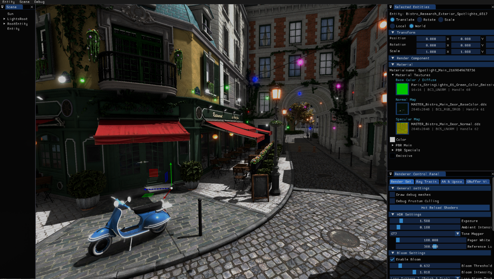

<div align="center">

  

  # Convolution Engine

  C++20 real-time Vulkan 1.4 renderer featuring a compiled RenderGraph, dual-threaded execution, clustered shading, hardware ray tracing, and NVIDIA Streamline (DLSS / DLSS-RR) integration.

  [](https://en.cppreference.com/w/cpp/20)
  [](https://www.vulkan.org/)
  [](https://cmake.org/)
  [](LICENSE)

</div>

---

## Threading Model

Convolution uses a **dual-threaded model** separating main thread CPU logic from render thread GPU command recording:

* **Main Thread:** Handles window input, ECS updates, game logic, and ImGui UI.
  * Entry: [`Boot.cpp`](Src/Boot.cpp) | Lifecycle: [`Application.cpp`](Src/Core/Application.cpp)
* **Render Thread:** Synchronizes ECS state, compiles the RenderGraph, records command buffers, manages swapchains, and publishes GPU timing.
  * Loop: [`RenderThread.cpp`](Src/Core/RenderThread.cpp) | Layer: [`RenderLayer.cpp`](Src/Core/Rendering/RenderLayer.cpp)
* **Thread Safety:** State is double-buffered via [`ApplicationState`](Src/Core/Global/State/ApplicationState.h). Main-thread writes queue via `RegisterUpdateFunction` and sync once per frame boundary.

---

## RenderGraph System

The pipeline is driven by a compiled, declarative **RenderGraph**:

* **[`RenderGraph`](Src/Core/Rendering/Core/RenderGraph/RenderGraph.h):** Tracks pass nodes, handles topological sorting, dependency compilation, side-effect culling, and batch generation.
* **[`RenderGraphBuilder`](Src/Core/Rendering/Core/RenderGraph/RenderGraphBuilder.h):** Used during `Pass::Setup()` to declare resource reads, writes, attachment formats, and view masks.
* **[`RGResourceRegistry`](Src/Core/Rendering/Core/RenderGraph/RGResourceRegistry.h):** Allocates render targets, manages resolution scaling, ping-pong history rotation, and bindless descriptors.
* **[`FrameTransitionRecorder`](Src/Core/Rendering/Core/FrameTransitionRecorder.h):** Records Vulkan image layout transitions and synchronization barriers between pass stages.

---

## Features

### Geometry & Lighting
* **G-Buffer Rasterization:** Reversed-Z depth pre-pass and main G-Buffer geometry pass ([`DepthPrePass`](Src/Core/Rendering/Passes/PreProcess/DepthPrePass.h), [`StaticMainMeshPass`](Src/Core/Rendering/Passes/StaticMeshPass.h)).
* **Clustered Shading:** Async compute frustum cluster generation and light grid culling ([`ClusterGeneratorComputePass`](Src/Core/Rendering/Passes/ClusteredShading/ClusterGeneratorComputePass.h), [`LightGridComputePass`](Src/Core/Rendering/Passes/ClusteredShading/LightGridComputePass.h)).
* **Shadows:** Single-pass **Vulkan Multiview** Cascaded Shadow Maps ([`CSMPass`](Src/Core/Rendering/Passes/ShadowPass.h)) and Bend Studio Screen-Space Shadows ([`ScreenSpaceShadowPass`](Src/Core/Rendering/Passes/ScreenSpaceShadowPass.h)).

### Hardware Ray Tracing (Vulkan KHR)
* **Acceleration Structures:** [`RTSceneManager`](Src/Core/Rendering/Core/RT/RTSceneManager.h) manages BLAS/TLAS lifecycles.
* **Ray Query / Passes:** Ray-traced reflections ([`RTReflectionsPass`](Src/Core/Rendering/Passes/RT/RTReflectionsPass.h)), ambient occlusion ([`RTAOPass`](Src/Core/Rendering/Passes/RT/RTAOPass.h)), and composite accumulation.

### Anti-Aliasing & Upscaling
* **Native AA:** TAA with camera sub-pixel jitter ([`TAAPass`](Src/Core/Rendering/Passes/AA/TAAPass.h)) and SMAA ([`SMAAPass`](Src/Core/Rendering/Passes/AA/SMAAPass.h)).
* **Upscalers:** NVIDIA DLSS Super Resolution & Ray Reconstruction via Streamline ([`DLSSPass`](Src/Core/Rendering/Passes/AA/DLSSPass.h)), Intel XeSS ([`XeSSPass`](Src/Core/Rendering/Passes/AA/XeSSPass.h)).

### Post-Processing & Compositing
* **Bloom & Tonemapping:** 13-tap downsample / 9-tap tent upsample bloom chain ([`BloomPass`](Src/Core/Rendering/Passes/PostProcess/BloomPass.h)), ACES / Uncharted 2 / GT7 tonemapping ([`CompositPass`](Src/Core/Rendering/Passes/Compositing/CompositPass.h)).
* **Editor UI:** ImGui interface with real-time G-Buffer inspectors, profiling stats, and scene manipulators ([`ImGuiPass`](Src/Core/Rendering/Passes/ImGuiPass.h)).

---

## ECS & Async Asset Pipeline

* **Entity Component System (ECS):** Managed by [`EntityManager`](Src/Core/ECS/EntityManager.h). Entities compose modular components (`Transform`, `RenderComponent`, `Light`) and update on the main thread via decoupled systems (`STransform`, `SLight`, `SView`, `SDebugDisplay`).
* **Mesh Pipeline:** Scene files are imported and converted to plain data ([`MeshDecoder`](Src/Core/IO/MeshDecoder.h), [`DecodedScene`](Src/Core/IO/DecodedScene.h)) on a worker. [`SceneStreamer`](Src/Core/SceneGraph/SceneStreamer.h) turns that into ECS entities, meshes and materials over several frames under the streaming budgets, so the camera can move while a scene loads.
* **Asynchronous I/O & File Loading:** [`FileReader`](Src/Core/IO/FileReader.h) decodes bytes, DDS/image textures and meshes on a thread pool. Image and mesh results are queued and delivered on the render thread (`DeliverCompleted`), so load callbacks never race with the ECS or the GPU. A generation counter drops results of a previous scene.
* **Bindless Texture Streaming:** [`TextureManagerBase`](Src/Core/Rendering/Core/TextureManagerBase.h) (shared) and [`VkTextureManager`](Src/Core/Rendering/Vulkan/VkTextureManager.h) create each texture in the frame its decode arrives and write it into the bindless arrays; a slot shows the placeholder until then.
* **Uploads:** [`AsyncQueueHandler`](Src/Core/Rendering/Core/TransferUtils/TransferQueueHandler.h) records all uploads of a frame (SSBO updates, streamed geometry, textures) into one command buffer on the graphics queue, staged through a per-frame arena.
* **Engine Settings:** the *Debug > Engine Settings* window edits the streaming budgets at runtime and shows streaming statistics.

---

## Profiling & Instrumentation

* **Tracy GPU Integration:** Integrated GPU & CPU zone profiling via [`VkTracyGPUManager`](Src/Core/Rendering/Vulkan/VkTracyManager.h) and Tracy VkContext scopes.
* **Vulkan Timing Queries:** Native Vulkan timestamp query pool management via [`GPUTimingQuery`](Src/Core/Rendering/Core/GPUTimingQuery.h) providing per-pass GPU execution times and real-time ImGui timing overlays.

---

## Building

### Requirements
1. **Vulkan SDK 1.3 / 1.4** (with acceleration structure, ray query, and buffer device address support)
2. **Visual Studio 2022** 
3. **CMake 3.22+** & **Git**

### Instructions
1. Clone repository
2. Generate project:
   ```bash
   cmake -S . -B build
   ```
3. Build:
   ```bash
   cmake --build build --config RelWithDebInfo
   ```
4. Download the `Resources` folder from [MEGA Resource Package](https://mega.nz/file/WAlCRD7T#ffCl3fJWD4FZmf_ta6iiJrSlBGHYgA2KpjFgsajCg84) and place it in the project root directory.

> Dependencies (GLFW, ImGui, EASTL, EAThread, Assimp, Tracy) are configured automatically via CMake.
